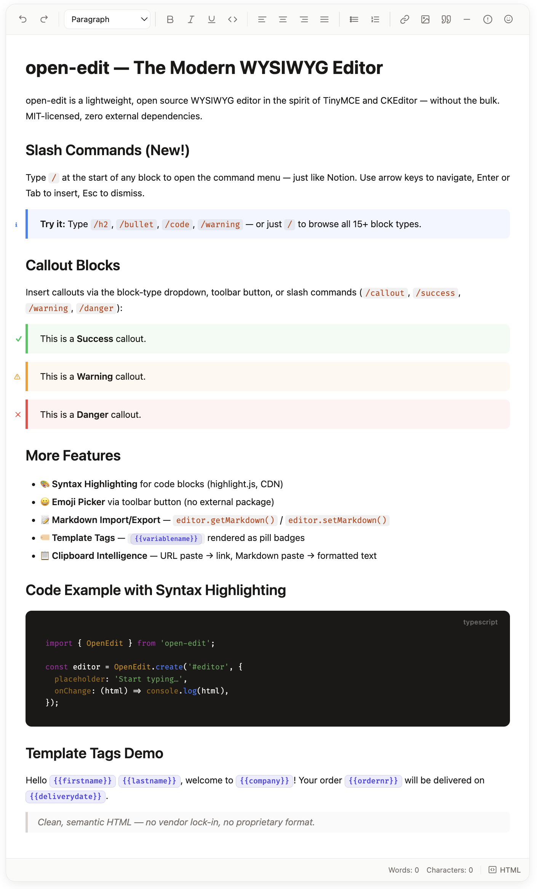

# open-edit — Lightweight JavaScript WYSIWYG Editor

[](https://www.npmjs.com/package/open-edit)
[](https://bundlephobia.com/package/open-edit)
[](#)
[](LICENSE)
[](https://github.com/cnagel08/open-edit/actions/workflows/ci.yml)

**A lightweight, open source rich text editor for the web — zero dependencies, ~31 kB gzipped.**

open-edit is a modern JavaScript WYSIWYG editor built on the `contenteditable` API. It works as a drop-in for any web project — plain HTML, React, Vue, or Svelte — and produces clean, semantic HTML5 output. No registration, no paid plans, MIT licensed.

[**Live Demo →**](https://cnagel08.github.io/open-edit/)

### Key Highlights

- **~31 kB** gzipped — fraction of TinyMCE or CKEditor
- **Zero runtime dependencies** — no bloat, no supply chain risk
- **Open source, MIT licensed** — free for personal and commercial use
- **Plugin system** — highlight, emoji, callout blocks, slash commands, AI assistant
- **Framework-agnostic** — React, Vue, Svelte, vanilla JS
- **Light / Dark / Auto theme** via CSS custom properties
- **Full TypeScript support**



---

## Why open-edit?

TinyMCE and CKEditor are powerful — but they ship hundreds of kilobytes, require registration or licensing, and pull in external dependencies. open-edit is different:

| | open-edit | TinyMCE | CKEditor 5 |
|---|---|---|---|
| Runtime dependencies | **0** | ~0 (self-hosted) | dozens |
| License | **MIT** | MIT / Commercial | GPL / Commercial |
| Self-hosted | **always** | yes | yes |
| Plugin system | **yes** | yes | yes |


---

## Quick Start

**Via CDN**

```html
<div id="editor"></div>
<script src="https://unpkg.com/open-edit/dist/open-edit.umd.js"></script>
<script>
  const editor = OpenEdit.create('#editor', {
    content: '<p>Hello <strong>world</strong>!</p>',
    placeholder: 'Start typing…',
    theme: 'auto',
    onChange: (html) => console.log(html),
  });
</script>
```

**Via npm**

```bash
npm install open-edit
```

```ts
import { OpenEdit } from 'open-edit';

const editor = OpenEdit.create('#editor', {
  placeholder: 'Start typing…',
  onChange: (html) => console.log(html),
});
```

---

## Features

**Core**

| Feature | Details |
|---|---|
| Text formatting | Bold, Italic, Underline, Strikethrough, Inline Code |
| Block elements | Paragraphs, Headings H1–H6, Lists, Blockquote, Code block, HR |
| Media | Images with drag-to-resize, upload hook |
| Editing | Text alignment, Links, Undo/Redo (50 steps) |
| I/O | HTML & Markdown import/export, smart clipboard paste |
| UI | Configurable toolbar, floating bubble toolbar, HTML source view, status bar |
| Theming | Light / Dark / Auto via CSS custom properties |

**Plugins** (all optional)

| Plugin | Description |
|---|---|
| `highlight` | Syntax highlighting for code blocks via highlight.js |
| `emoji` | Emoji picker in the toolbar |
| `templateTags` | Highlight and manage `{{variable}}` placeholders |
| `callout` | Info / Success / Warning / Danger callout blocks |
| `slashCommands` | Notion-style `/` command menu — 15+ block types |

---

## API Reference

### `OpenEdit.create(element, options?)`

Creates and mounts a new editor instance.

```ts
const editor = OpenEdit.create('#my-editor', options);
```

**Parameters:**

| Parameter | Type | Description |
|-----------|------|-------------|
| `element` | `string \| HTMLElement` | CSS selector or DOM element |
| `options` | `EditorOptions` | Optional configuration |

**`EditorOptions`:**

| Option | Type | Default | Description |
|--------|------|---------|-------------|
| `content` | `string` | `''` | Initial HTML content |
| `placeholder` | `string` | `''` | Placeholder text when empty |
| `theme` | `'light' \| 'dark' \| 'auto'` | `'auto'` | Color theme |
| `readOnly` | `boolean` | `false` | Disable editing |
| `toolbar` | `ToolbarItemConfig[]` | full toolbar | Full custom toolbar (takes precedence over `toolbarItems`) |
| `toolbarItems` | `string[]` | all items | Filter default toolbar by item ID — see [Toolbar Items](#toolbar-items) |
| `statusBar` | `boolean \| StatusBarOptions` | `true` | Show/hide the status bar or individual parts |
| `onChange` | `(html: string) => void` | — | Called on every content change |
| `onImageUpload` | `(file: File) => Promise<string>` | — | Handle image uploads |

#### Toolbar Items

Available IDs for `toolbarItems`:

| ID | Element |
|----|---------|
| `undo`, `redo` | Undo / Redo buttons |
| `blockType` | Block format dropdown (Paragraph, H1–H4, …) |
| `bold`, `italic`, `underline`, `code` | Inline formatting |
| `alignLeft`, `alignCenter`, `alignRight`, `alignJustify` | Text alignment |
| `bulletList`, `orderedList` | Lists |
| `link`, `image`, `blockquote`, `hr` | Insert elements |
| `callout` | Insert callout button (Info variant) |
| `htmlToggle` | HTML source view button |

```ts
// Minimal editor — only essential formatting
const editor = OpenEdit.create('#editor', {
  toolbarItems: ['bold', 'italic', 'underline', 'link'],
});

// Rich text editor without alignment and HTML toggle
const editor = OpenEdit.create('#editor', {
  toolbarItems: ['undo', 'redo', 'blockType', 'bold', 'italic', 'underline',
                 'bulletList', 'orderedList', 'link', 'image'],
});
```

#### Status Bar Options

```ts
// Hide the status bar entirely
OpenEdit.create('#editor', { statusBar: false });

// Show only word count, no HTML toggle
OpenEdit.create('#editor', {
  statusBar: { wordCount: true, charCount: false, elementPath: false, htmlToggle: false },
});
```

| Option | Default | Description |
|--------|---------|-------------|
| `wordCount` | `true` | Word count |
| `charCount` | `true` | Character count |
| `elementPath` | `true` | Element path (e.g. `p › strong`) |
| `htmlToggle` | `true` | HTML source toggle button |

---

### Instance Methods

```ts
// Content
editor.getHTML()           // → string   (clean HTML)
editor.setHTML(html)       // set content from HTML
editor.getMarkdown()       // → string   (Markdown)
editor.setMarkdown(md)     // set content from Markdown
editor.getDocument()       // → EditorDocument (internal model)

// Editor state
editor.isEmpty()           // → boolean
editor.isFocused()         // → boolean
editor.isMarkActive(type)  // → boolean  ('bold' | 'italic' | …)
editor.getActiveBlockType()// → string   ('paragraph' | 'heading' | …)
editor.getSelection()      // → ModelSelection | null

// Focus
editor.focus()
editor.blur()

// Events
editor.on('change', (doc) => { })
editor.on('selectionchange', (sel) => { })
editor.on('focus', () => { })
editor.on('blur', () => { })
editor.off('change', listener)

// Commands (chainable)
editor.chain()
  .toggleMark('bold')
  .setBlock('heading', { level: 2 })
  .setBlock('callout', { variant: 'warning' }) // insert/convert to callout
  .setAlign('center')
  .insertImage('https://example.com/img.png', 'alt text')
  .insertHr()
  .toggleList('bullet_list')
  .undo()
  .redo()
  .run()

// Plugins
editor.use(myPlugin)

// Cleanup
editor.destroy()
```

---

### Image Upload

```ts
const editor = OpenEdit.create('#editor', {
  onImageUpload: async (file) => {
    const formData = new FormData();
    formData.append('file', file);
    const res = await fetch('/api/upload', { method: 'POST', body: formData });
    const { url } = await res.json();
    return url; // must return the public URL string
  },
});
```

---

## Plugins

### Code Syntax Highlighting

Requires [highlight.js](https://highlightjs.org/) to be loaded.

```ts
import { OpenEdit } from 'open-edit';

const editor = OpenEdit.create('#editor');
editor.use(OpenEdit.plugins.highlight());
```

### Emoji Picker

```ts
editor.use(OpenEdit.plugins.emoji());
```

### Template Variables

Highlight `{{variable}}` patterns in the editor content.

```ts
editor.use(OpenEdit.plugins.templateTags({
  variables: ['name', 'email', 'company'],
}));
```

### Callout Blocks

Adds styled callout/notice blocks in four variants: **Info**, **Success**, **Warning**, **Danger**.

```ts
editor.use(OpenEdit.plugins.callout());
```

**Insert via toolbar:** Use the block-type dropdown or the ⓘ toolbar button (inserts Info callout).

**Insert via slash commands:** With the `slashCommands` plugin, type `/callout`, `/success`, `/warning`, or `/danger` to get a live-filtered menu. Without the slash commands plugin, the callout plugin also recognises these exact strings typed on a blank line followed by `Enter` (legacy behaviour).

| Slash query | Variant |
|---|---|
| `/callout`, `/info` | Info |
| `/success` | Success |
| `/warning` | Warning |
| `/danger` | Danger |

**Keyboard shortcut:** `Ctrl+Shift+I` inserts an Info callout.

**Change variant:** Click inside a callout and select a different variant from the block-type dropdown.

**Via the chain API:**

```ts
// Insert / convert current block to a callout
editor.chain().setBlock('callout', { variant: 'warning' }).run();

// Supported variants: 'info' | 'success' | 'warning' | 'danger'
```

**HTML output:**

```html
<div class="oe-callout oe-callout-warning" data-callout-variant="warning">
  Watch out for breaking changes!
</div>
```

**Adding a new variant** requires changes in three places:
1. `CalloutVariant` type in `src/core/types.ts`
2. CSS block in `src/view/styles.ts`
3. Locale strings in `src/locales/types.ts`, `en.ts`, `de.ts` and a new option in `src/view/toolbar.ts`

---

### Slash Commands

A Notion-style `/` command menu that lets users quickly insert any block type by typing a slash at the start of a line.

```ts
editor.use(OpenEdit.plugins.slashCommands());
```

**How it works:** Type `/` at the start of any block. A floating dropdown appears, filtered in real-time as you continue typing. Navigate with `↑`/`↓`, confirm with `Enter` or `Tab`, dismiss with `Escape`.

**Built-in commands (15+):**

| Query examples | Inserts |
|---|---|
| `/p`, `/paragraph` | Paragraph |
| `/h1` – `/h6`, `/heading1` | Heading 1–6 |
| `/quote`, `/bq` | Blockquote |
| `/code`, `/codeblock` | Code Block |
| `/bullet`, `/ul` | Bullet List |
| `/numbered`, `/ol` | Numbered List |
| `/hr`, `/divider`, `/---` | Horizontal Rule |
| `/callout`, `/info` | Callout: Info |
| `/success` | Callout: Success |
| `/warning` | Callout: Warning |
| `/danger`, `/error` | Callout: Danger |

**Adding extra commands:**

```ts
editor.use(OpenEdit.plugins.slashCommands({
  extraCommands: [
    {
      id: 'my-block',
      title: 'My Custom Block',
      description: 'Inserts something special',
      icon: '✦',                           // SVG string or text
      keywords: ['my', 'custom', 'special'],
      execute: (editor) => editor.chain().setBlock('paragraph').run(),
    },
  ],
}));
```

**Replacing the command list entirely:**

```ts
editor.use(OpenEdit.plugins.slashCommands({ commands: myCommands }));
```

The `SlashCommand` and `SlashCommandsOptions` types are exported for TypeScript consumers.

---

### Writing a Custom Plugin

```ts
import type { EditorPlugin } from 'open-edit';

const wordCountPlugin: EditorPlugin = {
  name: 'word-count',
  onInit(editor) {
    editor.on('change', () => {
      const text = editor.getHTML().replace(/<[^>]+>/g, ' ');
      const words = text.trim().split(/\s+/).filter(Boolean).length;
      console.log(`Word count: ${words}`);
    });
  },
  onDestroy(editor) {
    editor.off('change', () => {});
  },
};

editor.use(wordCountPlugin);
```

---

## Markdown Support

```ts
// Export as Markdown
const md = editor.getMarkdown();

// Import from Markdown
editor.setMarkdown('# Hello\n\nThis is **bold** text.');

// Utility functions
import { serializeToMarkdown, deserializeMarkdown } from 'open-edit';
```

---

## Internationalization (i18n)

OpenEdit ships with **English** and **German**. The UI language is detected automatically from the browser — no configuration needed.

### Auto-detection (default)

OpenEdit reads `navigator.language` and picks the matching built-in locale automatically. If the browser language is not supported yet, it falls back to English.

```ts
// Browser set to German → German UI automatically
// Browser set to French → English fallback
const editor = OpenEdit.create('#editor');
```

### Explicit locale

Override the auto-detection by passing a locale object:

```ts
import { OpenEdit, de } from 'open-edit';

const editor = OpenEdit.create('#editor', {
  locale: de,  // always German, regardless of browser language
});
```

Via CDN / `test.html` (UMD build — all locales are included):
```js
const editor = OpenEdit.create('#editor', {
  locale: OpenEdit.locales.de,
});
```

### Partial override

Override only individual strings, keep everything else as-is:

```ts
const editor = OpenEdit.create('#editor', {
  locale: {
    statusBar: { words: 'Mots', characters: 'Caractères', htmlSource: 'HTML' },
  },
});
```

### Available locales

| Import | Language | Auto-detected for |
|--------|----------|-------------------|
| `en` | English | default / fallback |
| `de` | German | `de`, `de-AT`, `de-CH`, … |

### Adding a new language

1. Create `src/locales/fr.ts` implementing `EditorLocale`
2. Add it to `BUILT_IN_LOCALES` in `src/editor.ts` for auto-detection
3. Export it from `src/index.ts`

TypeScript enforces completeness — a compile error is thrown for any missing key, so incomplete translations cannot be published.

```ts
import type { EditorLocale } from 'open-edit';

export const fr: EditorLocale = {
  toolbar: {
    undo: 'Annuler (Ctrl+Z)',
    // ... all keys required — TypeScript will tell you which ones are missing
  },
  // ...
};
```

---

## Theming

OpenEdit uses CSS custom properties. Override them to match your brand:

```css
:root {
  --oe-primary: #2563eb;
  --oe-bg: #ffffff;
  --oe-bg-toolbar: #f8fafc;
  --oe-border: #e2e8f0;
  --oe-text: #1e293b;
  --oe-radius: 8px;
  --oe-font: system-ui, sans-serif;
}
```

For dark mode, set `theme: 'dark'` or use `theme: 'auto'` to follow the OS preference.

---

## Framework Integration

### React

```tsx
import { useEffect, useRef } from 'react';
import { OpenEdit } from 'open-edit';
import type { EditorInterface } from 'open-edit';

export function Editor({ onChange }: { onChange: (html: string) => void }) {
  const ref = useRef<HTMLDivElement>(null);
  const editorRef = useRef<EditorInterface | null>(null);

  useEffect(() => {
    if (!ref.current || editorRef.current) return;
    editorRef.current = OpenEdit.create(ref.current, { onChange });
    return () => {
      editorRef.current?.destroy();
      editorRef.current = null;
    };
  }, []);

  return <div ref={ref} />;
}
```

> **Note:** The guard `|| editorRef.current` prevents double-initialisation in React 18 Strict Mode, which intentionally mounts effects twice in development.

### Vue 3

```vue
<script setup lang="ts">
import { onMounted, onUnmounted, ref } from 'vue';
import { OpenEdit } from 'open-edit';
import type { EditorInterface } from 'open-edit';

const container = ref<HTMLDivElement>();
let editor: EditorInterface;

onMounted(() => {
  editor = OpenEdit.create(container.value!, {
    onChange: (html) => emit('update:modelValue', html),
  });
});

onUnmounted(() => editor?.destroy());
</script>

<template>
  <div ref="container" />
</template>
```

---

## Local Development

```bash
git clone https://github.com/cnagel08/open-edit.git
cd open-edit
npm install
npm run dev       # build in watch mode
# open test.html in your browser to test the editor
```

```bash
npm run build     # production build → dist/
npm run lint      # ESLint
npm test          # minimal regression suite
```

---

## Repository Structure Notes

- `src/` is the OpenEdit library source and the only package code shipped to npm.
- `d35cb609-ad74-48a3-a8b4-26879657ff81/` is a standalone playground/reference app kept for comparison and experiments.
- `designs/preview/` is design/prototype material and not part of the published library bundle.

---

## Contributing

Contributions are welcome! Please read [CONTRIBUTING.md](.github/CONTRIBUTING.md) before opening a pull request.

---

## License

[MIT](LICENSE) © 2026 Christian Nagel

Free for personal and commercial use.
